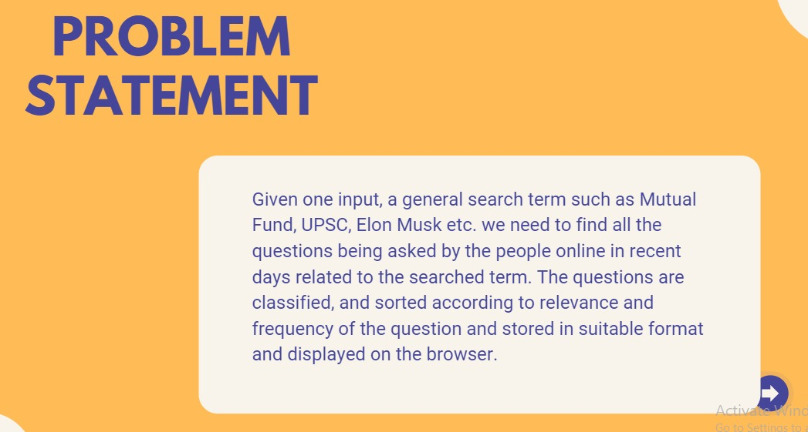
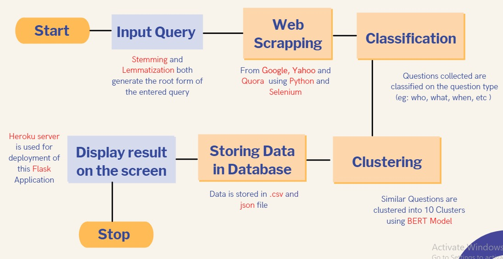
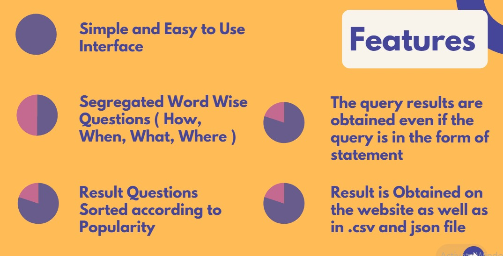
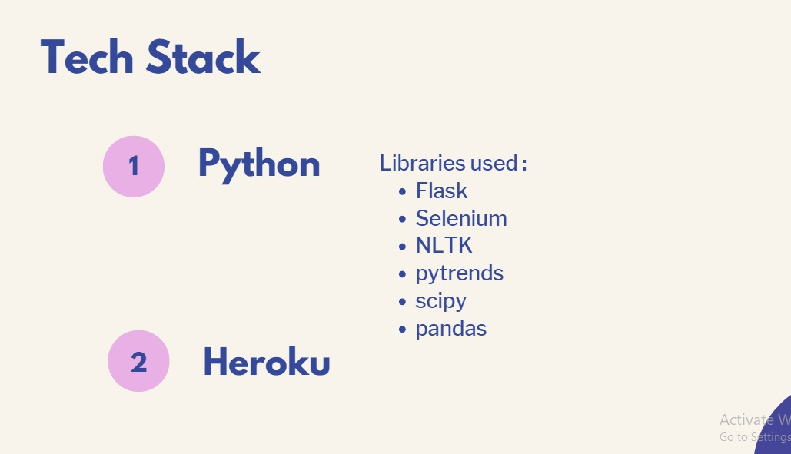

"# ERR_404-4.0" 

[Smart Search](https://smart-search-app.herokuapp.com/)

## How to use
```
$ git clone https://github.com/Ishan2601/Err_404-Four_Nodes-003-SmartSearch
$ cd Err_404-Four_Nodes-003-SmartSearch 
$ pip install -r requirements.txt
$ app.py
```
## Features Implemented
1. questions classification according to question type
2. Related top Searches
3. Generating csv file of questions.
4. Top Relevant Searches
5. Lemmatization and Similar questions clustering.
6. complete sentence searching
7. Better visuals

## Features to be implement 
1. AWS EC2 (if time permits)

## Presentation
<br>
<br>
<br>
<br>
<br>
<br>

## UI


