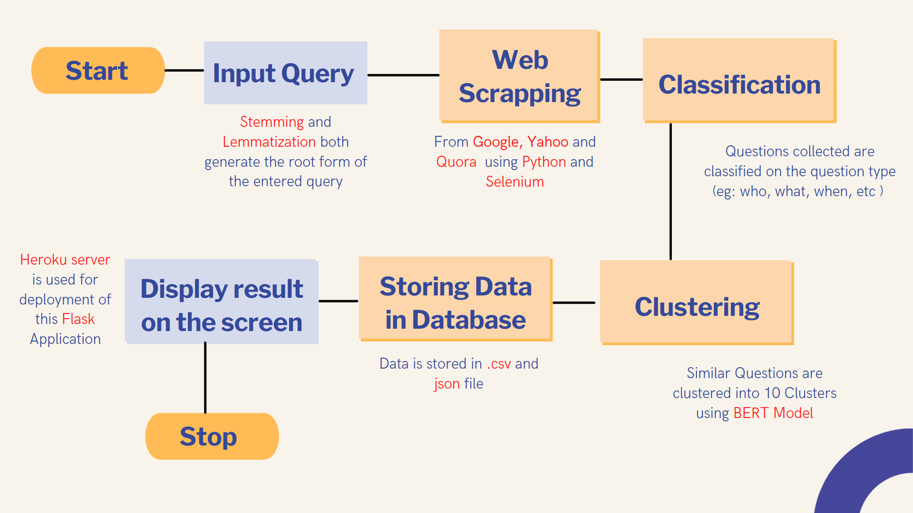
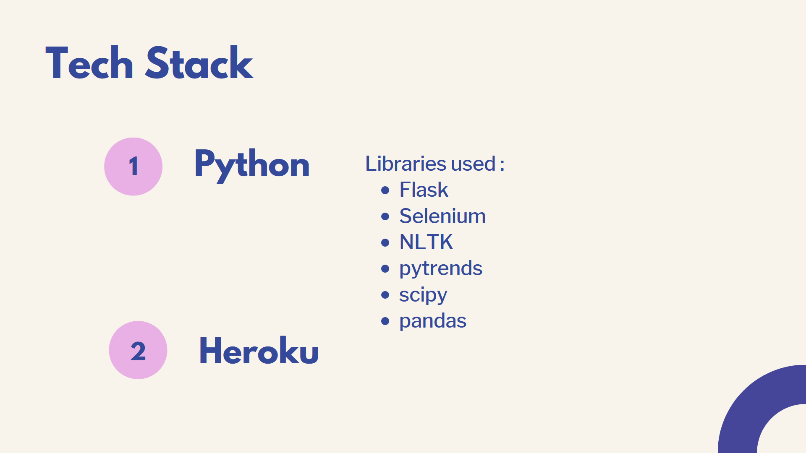
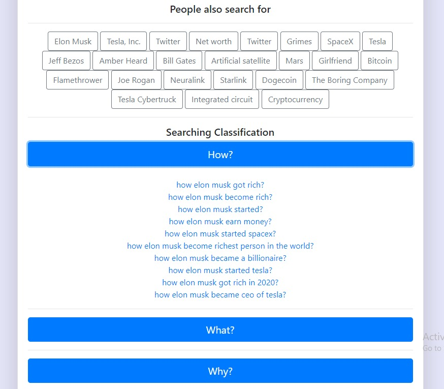
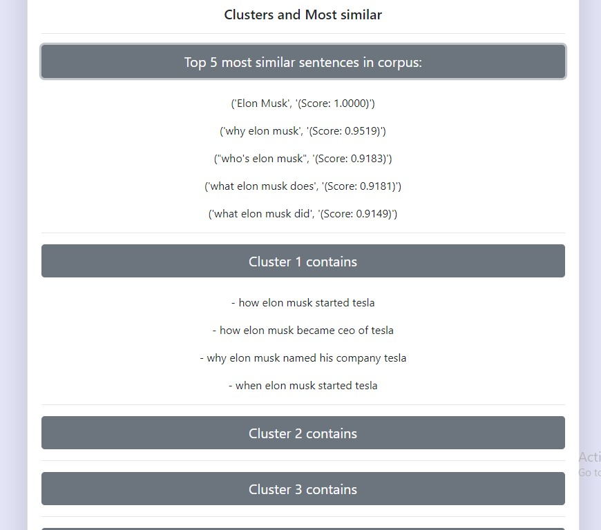

"# ERR_404-4.0" 

You can view the app here: [Smart Search](https://smart-search-app.herokuapp.com/)

## How to use
```
$ git clone https://github.com/Ishan2601/Err_404-Four_Nodes-003-SmartSearch
$ cd Err_404-Four_Nodes-003-SmartSearch 
$ pip install -r requirements.txt
$ python app.py
```
## Features
<br>

## Flow Chart
<br>

## Tech Stack
<br>

## UI
<br>
<br>
<br>
<br>


